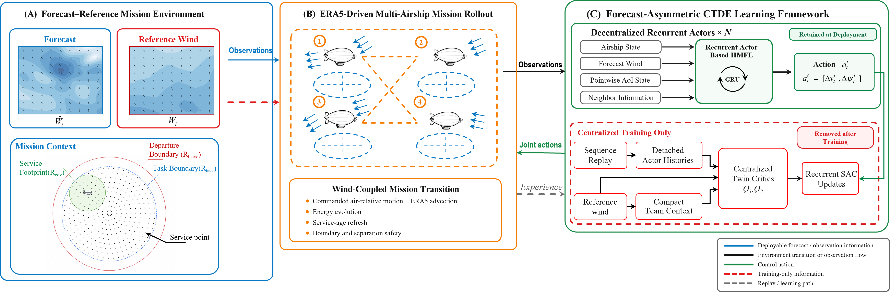
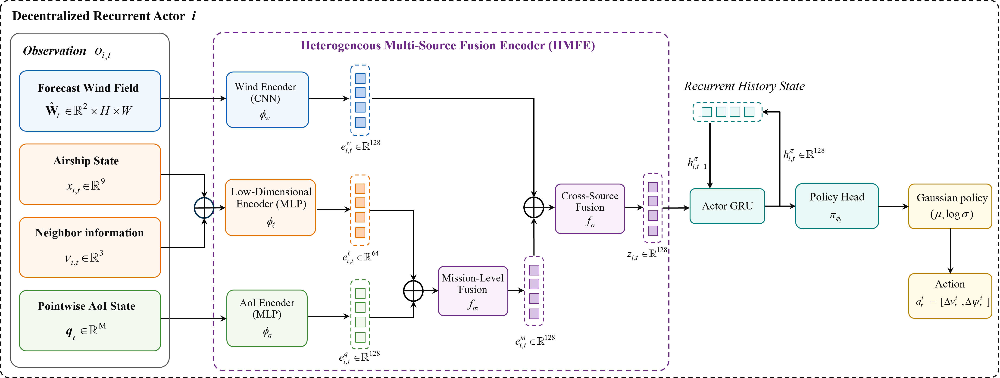
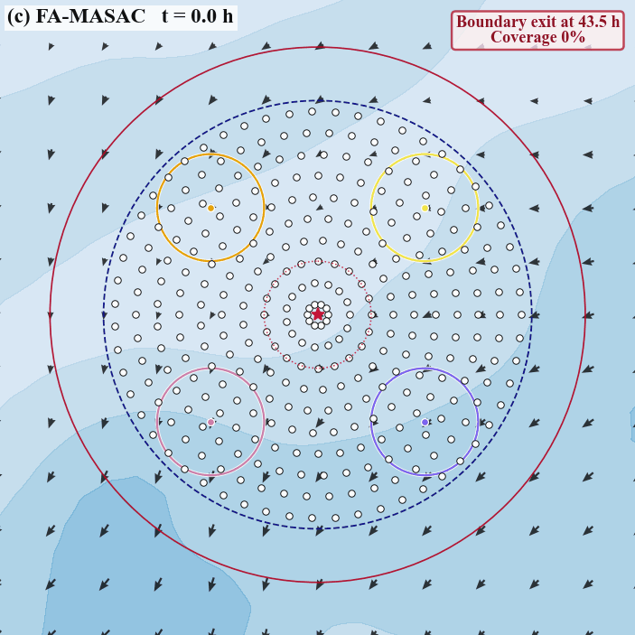
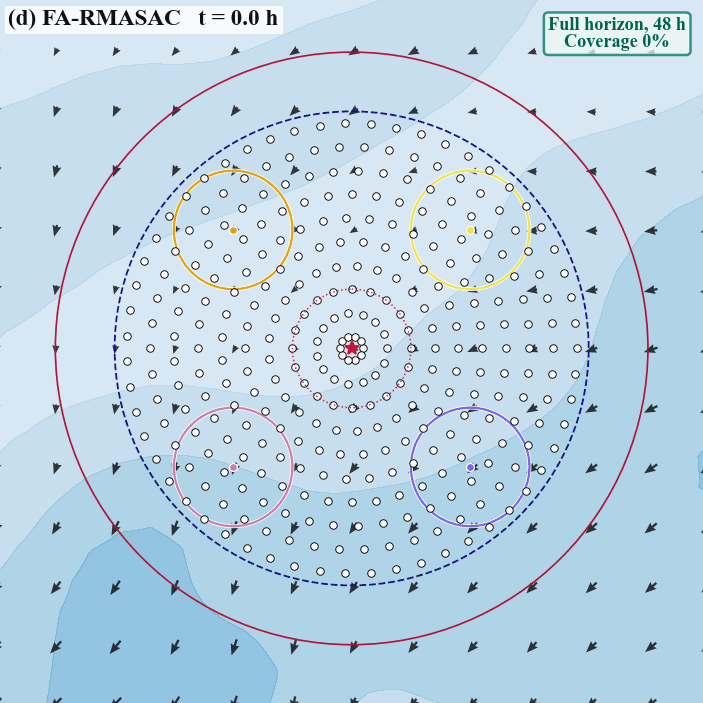

# FA-RMASAC Supplementary Materials

This repository contains visual supporting materials for the manuscript **“Cooperative Persistent Coverage by a Swarm of Stratospheric Airships under Wind-Forecast Uncertainty.”**

FA-RMASAC denotes **Forecast-Asymmetric Recurrent Multi-Agent Soft Actor–Critic**. The method combines forecast-aware decentralized recurrent actors with centralized training for cooperative persistent coverage under wind-forecast uncertainty.

This repository intentionally contains only presentation-ready figures and animations. It does **not** include source code, raw or processed data, trajectories, numerical result files, model weights, training configurations, or logs.

## FA-RMASAC framework



The closed-loop framework comprises the paired forecast–reference mission environment, the wind-coupled multi-airship rollout, and the forecast-asymmetric centralized-training/decentralized-execution workflow. Actors use deployment-available forecast-side observations, while the reference wind drives the physical transition and is available to the centralized critics during training.

## HMFE recurrent actor architecture



The Heterogeneous Multi-Source Fusion Encoder (HMFE) uses source-specific branches for the forecast wind field, airship state, neighbor information, and pointwise age-of-information state. The fused representation is aggregated by a GRU and mapped to a bounded stochastic action.

## Representative four-policy case study

The following animations show **four policies in the same matched representative scenario**, rather than four independent scenarios. Their public filenames retain only the corresponding method names; raw scenario metadata and trajectory data are intentionally omitted.

| ERA5-MLP | ERA5-GRU |
|:---:|:---:|
|  |  |

| FA-MASAC | FA-RMASAC |
|:---:|:---:|
|  |  |

## Repository contents

```text
.
├── animations/
│   ├── ERA5-GRU.gif
│   ├── ERA5-MLP.gif
│   ├── FA-MASAC.gif
│   └── FA-RMASAC.gif
├── figures/
│   ├── FA-RMASAC-Framework.png
│   └── HMFE-Architecture.png
└── README.md
```

## Citation

The manuscript is currently identified by the title above. Complete bibliographic information will be added when it becomes available.
